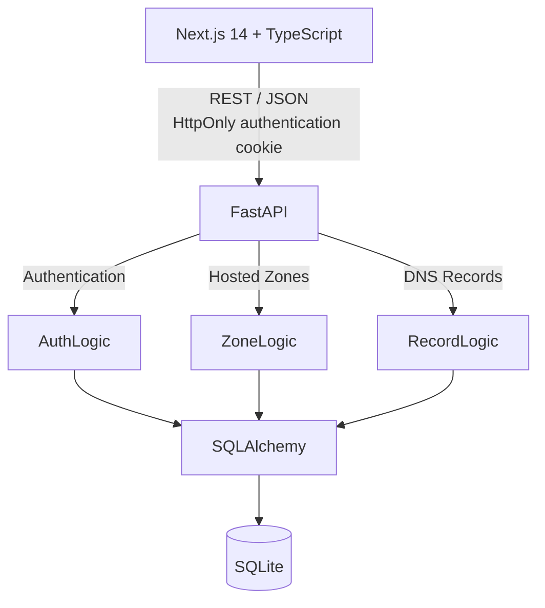

# AWS Route 53 Console Clone

A full-stack implementation of core AWS Route 53 workflows built with Next.js, FastAPI, and SQLite. The project recreates hosted-zone and DNS-record management using AWS Cloudscape components, with mocked authentication and AWS-dependent services.

> **Live Demo:** [View Live Application Here](https://aws-route53-clone-git-main-harsh2os-projects.vercel.app/login) 
> 
> **Demo Credentials:** 
> - **Username:** `admin` 
> - **Password:** `admin123`

---

## Screenshots

<details>
<summary><b>1. Route 53 Dashboard</b></summary>
<br/>

</details>

<details>
<summary><b>2. Hosted Zones / Create Record</b></summary>
<br/>

</details>

<details>
<summary><b>3. Login Screen</b></summary>
<br/>

</details>

*(Note: Ensure screenshots are saved in the `docs` folder as `dashboard.png`, `hosted_zones.png`, and `login.png`)*

---

## Features

- **AWS-Styled Interface**: AWS Cloudscape-based interface modeled strictly after the Route 53 console.
- **Hosted Zones Management**: Create, view, and delete Public or Private hosted zones. 
- **DNS Records Management**: Comprehensive support for 9 DNS record types (`A`, `AAAA`, `CNAME`, `TXT`, `MX`, `NS`, `PTR`, `SRV`, `CAA`).
- **Data Synchronization**: TanStack Query handles API caching, invalidation, and loading states.
- **Authentication**: Mock authentication using bcrypt password hashing and HttpOnly session cookies.

---

## Architecture



---

## Tech Stack

- **Frontend:** Next.js 14 (App Router), React, AWS Cloudscape Design System, TanStack React Query v5
- **Backend:** FastAPI (Python), SQLAlchemy, SQLite
- **Authentication:** JWT (JSON Web Tokens) with HttpOnly cookies, Bcrypt

---

## Database Schema

```text
User
 ├── id
 ├── username
 └── password_hash

HostedZone
 ├── id
 ├── aws_zone_id
 ├── name
 ├── type
 ├── description
 └── user_id

DNSRecord
 ├── id
 ├── zone_id
 ├── name
 ├── type
 ├── ttl
 ├── value
 └── routing_policy

Session
 ├── id
 ├── user_id
 ├── token
 └── expires_at
```

**Relationships:**
`User 1 → N HostedZone → N DNSRecord`

---

## API Endpoints

| Method | Endpoint                         | Purpose           |
| ------ | -------------------------------- | ----------------- |
| POST   | `/api/v1/auth/login`             | Authenticate      |
| POST   | `/api/v1/auth/logout`            | End session       |
| GET    | `/api/v1/auth/me`                | Current user      |
| GET    | `/api/v1/hosted-zones`           | List/search zones |
| POST   | `/api/v1/hosted-zones`           | Create zone       |
| GET    | `/api/v1/hosted-zones/{id}`      | Get zone details  |
| DELETE | `/api/v1/hosted-zones/{id}`      | Delete zone       |
| GET    | `/api/v1/hosted-zones/{id}/records`| List records    |
| POST   | `/api/v1/hosted-zones/{id}/records`| Create record   |
| DELETE | `/api/v1/hosted-zones/{id}/records/{record_id}`| Delete record |

---

## Local Setup

### 1. Backend Setup

```bash
cd backend
python -m venv venv
source venv/bin/activate  # On Windows: venv\Scripts\activate
pip install -r requirements.txt
python seed_demo.py       # Seeds the database with admin user
uvicorn app.main:app --reload --port 8000
```

### 2. Frontend Setup

```bash
cd frontend
npm install
npm run dev
```
*Frontend will be running at `http://localhost:3000`.*

---

## Testing

*To be implemented in future iterations.*

---

## Design Decisions, Mocked Functionality & Limitations

- **Route 53 behavior implemented:** Creating a hosted zone automatically generates system-level `NS` and `SOA` records. These system records are protected and cannot be manually edited or deleted by the user. Hosted-zone IDs explicitly mimic the AWS `/hostedzone/Z...` format.
- **Dynamic forms:** Record creation forms dynamically change structure and validation according to the selected DNS type (e.g. SRV vs A records).
- **Mocked AWS Infrastructure:** For "Private" hosted zones, the AWS Region and VPC ID dropdowns are purely visual implementations to demonstrate conditional UI rendering matching Route 53.
- **Synchronous Operations:** Real DNS propagation takes time, but in this clone, record creation and deletion are handled synchronously for immediate user feedback.
