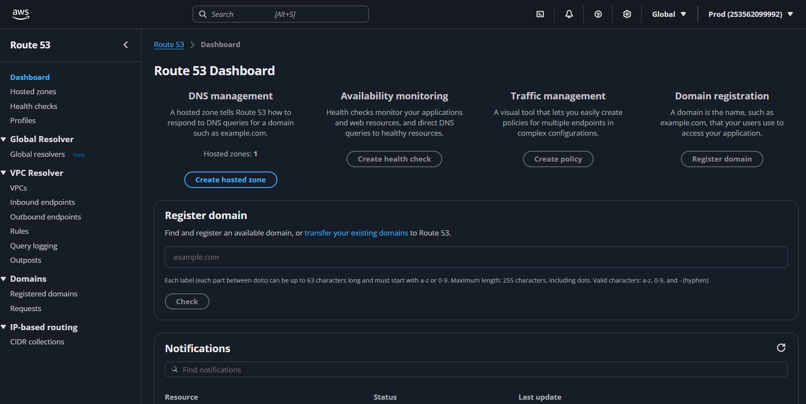
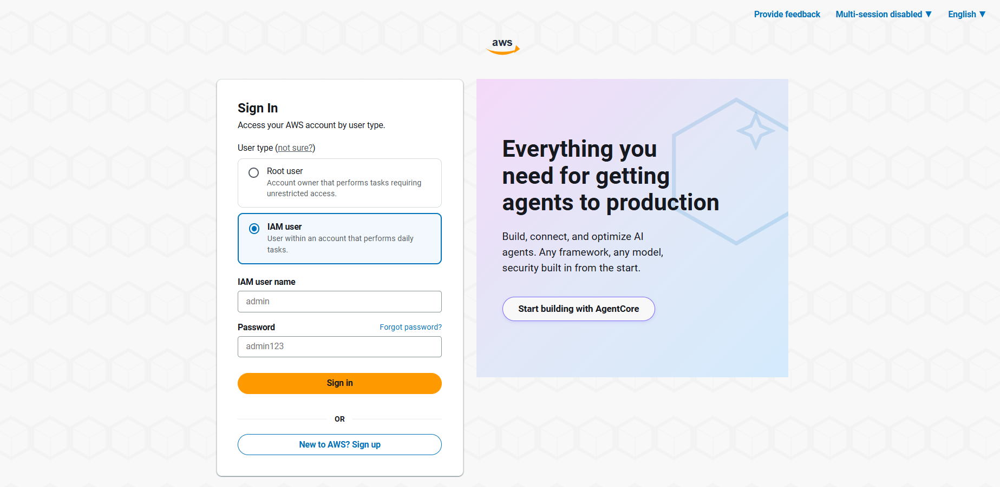
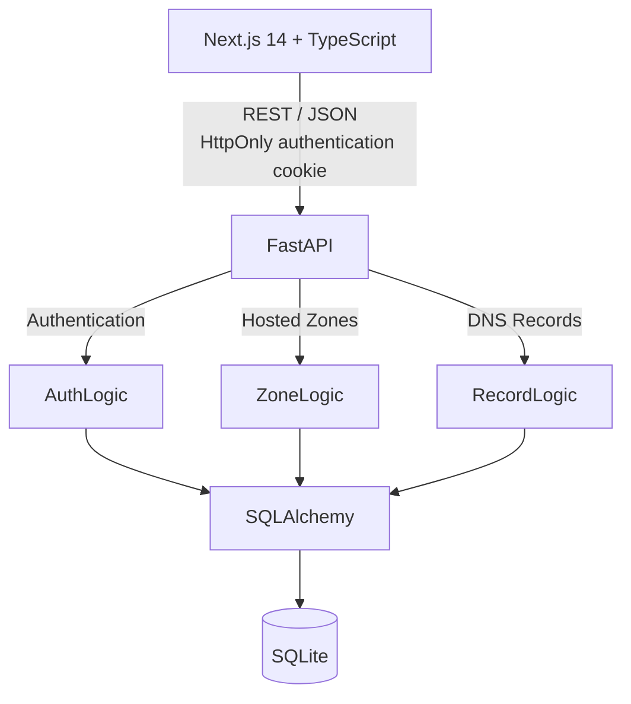

<div align="center">
  
  
  <h1 align="center">AWS Route 53 Console Clone</h1>
  
  <p align="center">
    <strong>A high-fidelity, full-stack implementation of core AWS Route 53 workflows.</strong><br/>
    Built with Next.js, FastAPI, and SQLite to recreate hosted-zone and DNS-record management.
  </p>

  <p align="center">
    <a href="https://aws-route53-clone-git-main-harsh2os-projects.vercel.app/login"><b>Live Demo</b></a> •
    <a href="#-features"><b>Features</b></a> •
    <a href="#-architecture"><b>Architecture</b></a> •
    <a href="#-local-setup"><b>Setup</b></a>
  </p>
  
  <p align="center">
    
    
    
    
    
  </p>
</div>

<br/>

>  **Demo Credentials:** 
> Username: `admin` | Password: `admin123`

---

##  Screenshots

<table>
  <tr>
    <td align="center" width="50%"><b>Route 53 Dashboard</b></td>
    <td align="center" width="50%"><b>Hosted Zones & Records</b></td>
  </tr>
  <tr>
    <td valign="top"></td>
    <td valign="top"></td>
  </tr>
  <tr>
    <td align="center" colspan="2"><b>Authentication (IAM Login)</b></td>
  </tr>
  <tr>
    <td colspan="2" align="center"></td>
  </tr>
</table>

---

##  Features

- **AWS-Styled Interface**: Authentic Cloudscape-based interface modeled strictly after the Route 53 console.
- **Hosted Zones Management**: Create, view, and delete Public or Private hosted zones. 
- **DNS Records Management**: Comprehensive support for 9 DNS record types (`A`, `AAAA`, `CNAME`, `TXT`, `MX`, `NS`, `PTR`, `SRV`, `CAA`).
- **Data Synchronization**: TanStack Query handles API caching, invalidation, and seamless loading states.
- **Authentication**: Secure mock authentication utilizing bcrypt password hashing and HttpOnly session cookies.

---

##  Architecture



---

##  Database Schema

```text
User                      HostedZone                    DNSRecord
 ├── id                    ├── id                        ├── id
 ├── username              ├── aws_zone_id               ├── zone_id
 └── password_hash         ├── name                      ├── name
                           ├── type                      ├── type
Session                    ├── description               ├── ttl
 ├── id                    └── user_id                   ├── value
 ├── user_id                                             └── routing_policy
 ├── token                 
 └── expires_at            [User] 1 ─── N [HostedZone] 1 ─── N [DNSRecord]
```

---

##  API Endpoints

| Method | Endpoint                         | Purpose           |
| ------ | -------------------------------- | ----------------- |
| `POST`   | `/api/v1/auth/login`             | Authenticate session |
| `POST`   | `/api/v1/auth/logout`            | End active session |
| `GET`    | `/api/v1/auth/me`                | Retrieve current user |
| `GET`    | `/api/v1/hosted-zones`           | List and search zones |
| `POST`   | `/api/v1/hosted-zones`           | Create a new zone |
| `GET`    | `/api/v1/hosted-zones/{id}`      | Get zone details  |
| `DELETE` | `/api/v1/hosted-zones/{id}`      | Delete a zone     |
| `GET`    | `/api/v1/hosted-zones/{id}/records`| List DNS records |
| `POST`   | `/api/v1/hosted-zones/{id}/records`| Create DNS record |
| `DELETE` | `/api/v1/hosted-zones/{id}/records/{id}`| Delete DNS record |

---

##  Local Setup

### 1. Backend Setup (FastAPI)

```bash
cd backend
python -m venv venv
source venv/bin/activate  # Windows: venv\Scripts\activate
pip install -r requirements.txt
python seed_demo.py       # Seeds the database with admin user
uvicorn app.main:app --reload --port 8000
```

### 2. Frontend Setup (Next.js)

```bash
cd frontend
npm install
npm run dev
```
*Frontend will be running at `http://localhost:3000`.*

---

##  Design Decisions & Limitations

- **Route 53 Behavior:** Creating a hosted zone automatically generates system-level `NS` and `SOA` records. These system records are protected and cannot be manually edited or deleted. Hosted-zone IDs explicitly mimic the AWS `/hostedzone/Z...` format.
- **Dynamic Forms:** Record creation forms dynamically change structure and validation according to the selected DNS type (e.g., SRV vs A records).
- **Mocked AWS Infrastructure:** For "Private" hosted zones, the AWS Region and VPC ID dropdowns are purely visual implementations to demonstrate conditional UI rendering matching Route 53.
- **Synchronous Operations:** Real DNS propagation takes time, but in this clone, record creation and deletion are handled synchronously for immediate user feedback.
